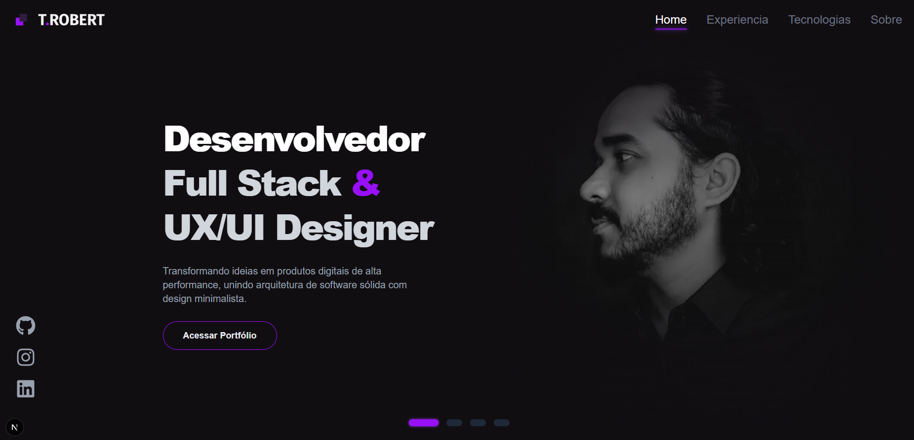
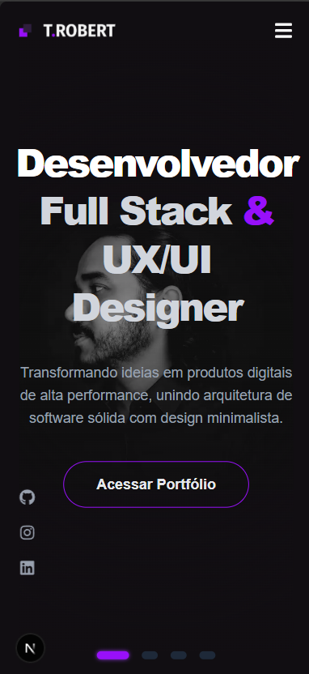
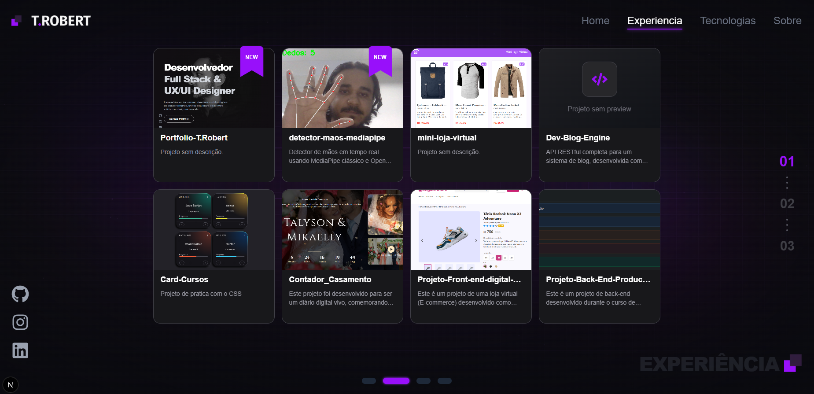
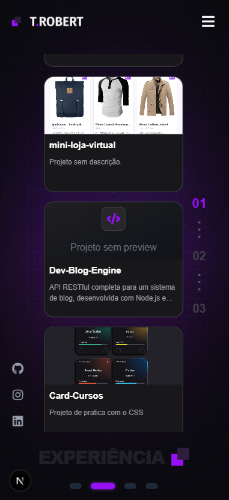
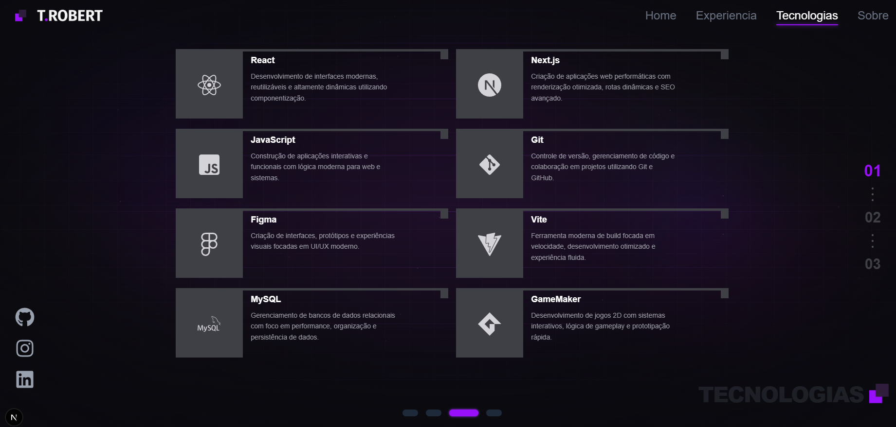
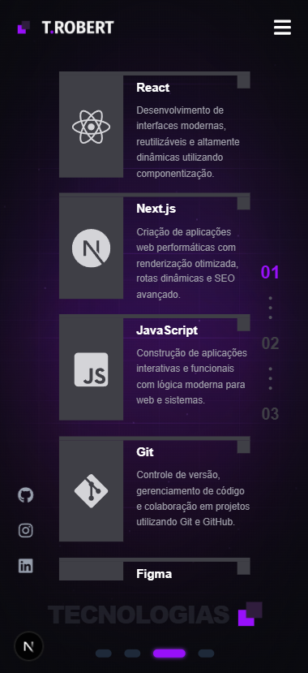
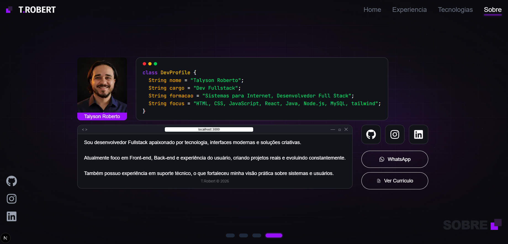
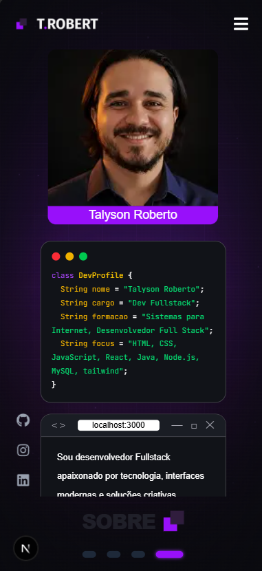

# 🚀 T.Robert

### Portfólio Full Stack Developer

Portfólio pessoal desenvolvido com foco em performance, design moderno e experiência do usuário.

 

---

# ✨ Sobre o Projeto

O projeto foi desenvolvido para centralizar minhas experiências, tecnologias e projetos em uma interface moderna, responsiva e minimalista.

O portfólio possui animações suaves, integração com GitHub e foco total em experiência visual.

---

# 📌 Seções

## 🏠 Home

Página inicial com apresentação principal e identidade visual do portfólio.

  
  

---

## 💼 Experiência

Projetos e experiências integradas diretamente com repositórios do GitHub.

  
  

---

## ⚡ Tecnologias

Área dedicada às tecnologias e ferramentas que possuo conhecimento.

  
  

---

## 👤 Sobre

Seção com foto, descrição pessoal, redes sociais, WhatsApp e currículo.

  
  

---

# 🛠️ Tecnologias Utilizadas

- Next.js
- React
- TypeScript
- Tailwind CSS
- Framer Motion

---

# 📱 Responsividade

O projeto foi desenvolvido para funcionar perfeitamente em:

- 💻 Desktop
- 📱 Smartphones
- 📟 Tablets

---

# 🎨 Design

O visual do projeto segue uma proposta:

- Minimalista
- Moderna
- Responsiva
- Focada em UX/UI
- Com efeitos visuais e animações suaves

---

# 👨‍💻 Créditos

Desenvolvido por [Talyson Roberto](https://github.com/talysonroberto)

### 🔗 Redes

- GitHub: https://github.com/talysonroberto
- LinkedIn: https://linkedin.com/in/talyson-roberto
- Instagram: https://instagram.com/talysonroberto_

---
